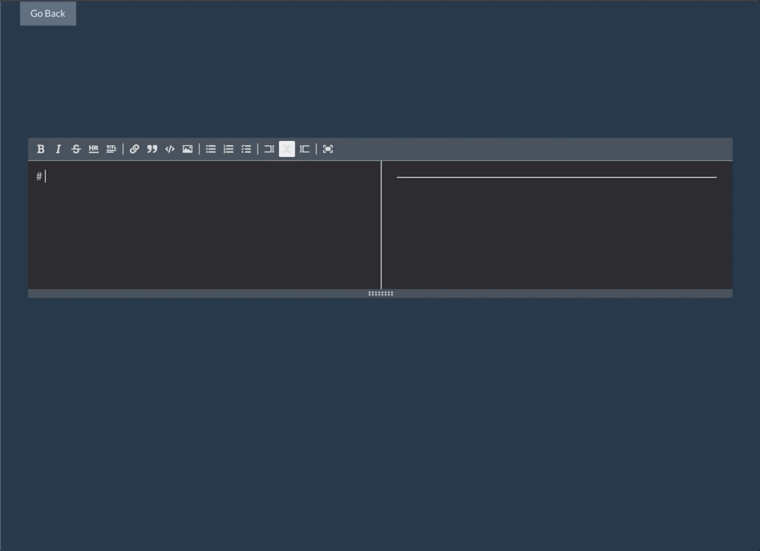

# Cocell

[cocell.io](https://www.cocell.io)

> Interactive online JavaScript IDE that you can use to build and test front-end code

### Getting Started :smile:

```
git clone https://github.com/YazanAlmatar99/cocell
```

```
cd cocell && npm install
```

```
npm start
```

### What do you need to know?

- You can add an infinite number of cells by clicking on the + Code or + Text icon
- Each cell can read the code from all of the previous cells, you can define a variable and reference it in the next cells.
- Click the Format button to use builtin Prettier to format your code.
- You can import CSS libraries - Example: `import 'bulma/css/bulma.css'`
- Delete cells, move cells up or down by using the navigation arrows on the top right.

#### You can import external libraries like React simply by importing React like you would normally do on your local machine


You can also write Markdown in the text cells!



> It uses unpkg.com to import NPM packages and ESBuild to bundle code.

##### v1.0
